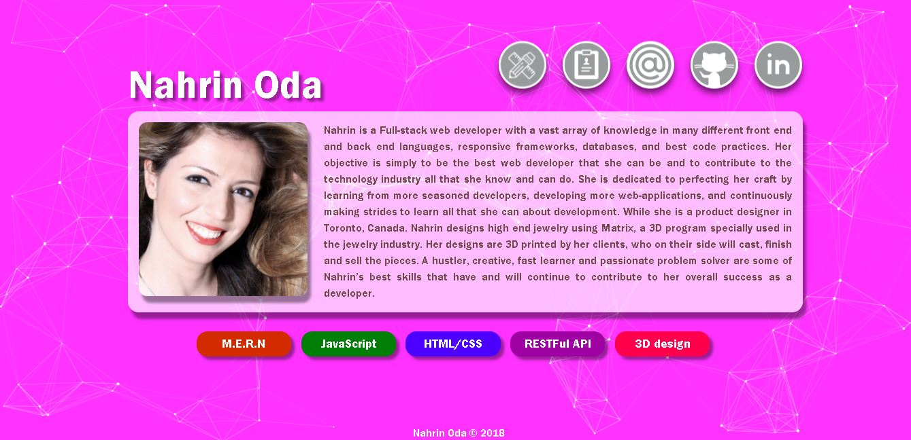
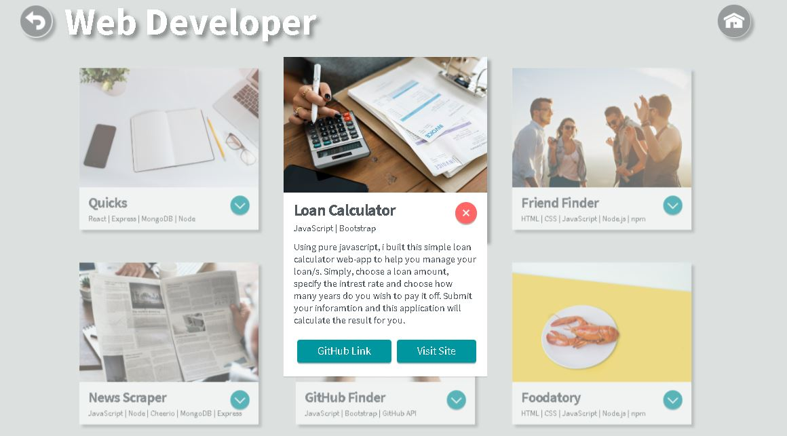

### My Profile in JavaScript

This is a JavaScript version of my portfolio website, it is a responsive website that allows visitors to instantly interact with me by checking my work, skills, check my online profiles and resume and send me emails.

---

### Landing Page Background

1. Background colour changes by mouse move coordinates
2. Animated icons are for: Portfolio, my CV, send me E-mail, my GitHub and my linkedIn links
3. My portfolio page is seperated into two animated sections
4. Projects cards are animated as well. Each card includes, job description and necessary links

---

### Landing Page

---

### Second Page

---

### Developer Page

---

### Designer Page

---

[See Project](https://nahrinoda.github.io/My-profile-in-Javascript/landingPage.html)
